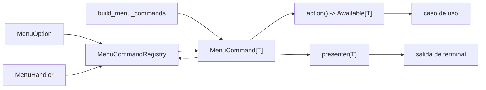

# Añadir una opción a la terminal

La terminal se amplía desde un catálogo de comandos tipados. Una opción no
requiere añadir otro método a `MenuHandler` ni otra dependencia a
`MenuDependencies`: se declara en `MenuOption` y se registra como un
`MenuCommand[T]` en `build_menu_commands`.

## Diseño del punto de extensión



Cada `MenuCommand[T]` reúne:

- la opción visible;
- una acción asíncrona sin argumentos que devuelve `T`;
- un presentador que acepta exactamente ese `T`.

`MenuCommandRegistry` comprueba que no haya opciones ni IDs duplicados y
resuelve la selección del usuario. `MenuHandler` solo controla el progreso,
la opción inválida y la frontera común de errores. No conoce casos de uso ni
tipos de resultado.

`MenuDependencies` permanece estable y contiene únicamente el registro,
errores, prompts, vista del menú y progreso. Los servicios concretos se
conectan a los comandos en `src/composition.py`.

## Elegir el alcance correcto

Antes de cambiar código, identifica qué parte es realmente nueva:

| Necesidad | Cambio |
| --- | --- |
| Nueva entrada del menú con capacidades existentes | `MenuOption` y `build_menu_commands` |
| Parámetro interactivo nuevo | `PromptReader`, `ConsolePrompts` y una closure en composición |
| Representación nueva | puerto de presentación, presenter concreto y su test |
| Regla o dato de negocio nuevo | modelo de dominio y tests de invariantes |
| Orquestación nueva | puerto de entrada y caso de uso de aplicación |
| HTTP, persistencia o archivos nuevos | puerto de salida y adaptador de infraestructura |

No crees una capa completa si solo estás exponiendo una combinación nueva de
capacidades existentes.

## Caso 1: reutilizar una capacidad existente

Para añadir un resumen de la semana anterior:

### 1. Declarar la opción

En [options.py](../src/presentation/menu/options.py):

```python
class MenuOption(Enum):
    # Opciones existentes...
    PREVIOUS_WEEKLY_REPORT = (
        12,
        MenuCategory.INSIGHTS,
        "Previous-week training summary",
    )
```

El ID debe ser único y estable. No renumeres opciones ya publicadas.

### 2. Registrar el comando

En [composition.py](../src/composition.py), añade al registro que devuelve
`build_menu_commands`:

```python
MenuCommand[WeeklyActivitySummary](
    option=MenuOption.PREVIOUS_WEEKLY_REPORT,
    action=partial(
        services.summary.generate_summary,
        week=WeekSelection.PREVIOUS,
    ),
    presenter=summary_presenter.present_weekly_report,
)
```

`partial` fija una entrada semántica sin duplicar una función. No cambian
`MenuHandler`, `MenuDependencies`, `main.py`, el renderer ni el caso de
uso.

### 3. Probar la conexión

El test pertenece a `tests/test_cli_command_composition.py` y debe verificar
tanto la acción como el presenter:

```python
@pytest.mark.asyncio
async def test_previous_weekly_report_selects_previous_week_and_presenter(
    command_composition: CommandComposition,
) -> None:
    result = await command_composition.registry.resolve("12").execute()

    command_composition.summary.generate_summary.assert_awaited_once_with(
        week=WeekSelection.PREVIOUS
    )
    command_composition.summary_presenter.present_weekly_report.assert_called_once_with(
        result
    )
```

Actualiza también el test que exige que el catálogo predeterminado contenga
todas las opciones.

## Caso 2: pedir datos antes de ejecutar

Una acción de comando no recibe parámetros. Cuando necesita entrada del
usuario, declara una closure asíncrona local en `build_menu_commands`. La
opción 11, que exporta las zonas cardiacas a JSON, aplica este patrón:

```python
async def export_activity_zones() -> ActivityZonesExportResult:
    activity_id = prompts.ask_activity_id()
    return await services.activity_zones_export.export_activity_zones(activity_id)
```

La acción se registra con su presenter tipado:

```python
MenuCommand[ActivityZonesExportResult](
    option=MenuOption.EXPORT_ACTIVITY_ZONES,
    action=export_activity_zones,
    presenter=with_heading(
        MenuOption.EXPORT_ACTIVITY_ZONES.description,
        result_presenter.present_heading,
        result_presenter.present_activity_zones_export,
    ),
)
```

`with_heading` decora un presenter cuando la salida necesita la cabecera
estándar. No hay un dispatch central por `isinstance`: cada comando elige el
presenter compatible al construirse.

Reutiliza `PromptReader.ask_activity_id` si la entrada ya existe. Solo amplía
`PromptReader` y `ConsolePrompts` para una entrada realmente distinta, y
prueba por separado valores inválidos, reintentos, EOF y cancelación cuando
sean relevantes.

## Caso 3: añadir una capacidad completa

Si la opción introduce, por ejemplo, la consulta del perfil del atleta:

1. Modela el estado y sus invariantes en `src/domain`.
2. Declara la necesidad externa como un `Protocol` pequeño en
   `src/application/ports`.
3. Implementa el caso de uso en `src/application/use_cases`, recibiendo el
   puerto por constructor.
4. Valida el payload externo y crea el modelo de dominio desde
   `src/infrastructure`.
5. Añade el servicio a `ApplicationServices` y constrúyelo en
   `build_application_services`.
6. Añade la opción y registra su `MenuCommand[T]` en `build_menu_commands`.
7. Implementa un presenter tipado si el resultado no tiene representación.

`main.py` debe seguir limitado al bootstrap y al ciclo de vida. Tampoco se
añade el caso de uso a `MenuDependencies`: el comando ya encapsula la acción
ejecutable.

Prueba cada responsabilidad donde vive:

- dominio: caso válido, límites, tipos erróneos e invariantes;
- mapper: payload válido, campos ausentes y tipos externos inválidos;
- gateway: endpoint, parámetros y traducción de errores;
- caso de uso: orquestación, resultado vacío y fallos;
- composición de comandos: selección de acción, argumentos y presenter;
- presentación: contenido visible y resultados vacíos;
- composición de servicios: implementación construida e inyectada.

Ningún test necesita credenciales ni red real.

## Booleanos: estado frente a comportamiento

Un `bool` no es incorrecto por sí mismo. Es adecuado cuando representa un
hecho binario del dominio cuyo nombre es inequívoco, como un dato recibido de
Strava. Es una mala interfaz cuando cambia el comportamiento de una operación:

```python
# Evitar: dos intenciones y un efecto externo ocultos.
await zones.get(activity_id, save=True)

# Preferir: consulta y exportación son casos de uso distintos.
await activity_zones.get_activity_zones(activity_id)
await activity_zones_export.export_activity_zones(activity_id)
```

Tampoco uses `previous=True` o `detailed=False`. Si varias opciones son la
misma operación con una selección legítima, usa un tipo semántico:

```python
await summary.generate_summary(week=WeekSelection.PREVIOUS)
```

La regla práctica es:

- separa casos de uso cuando cambian la intención, los efectos o las
  dependencias;
- reutiliza un caso de uso cuando solo cambia un dato explícito de la misma
  operación;
- representa ese dato con un `Enum` o value object si `True`/`False` no
  explica su significado en el punto de llamada.

No hace falta una clase por cada línea del menú. Las opciones de semana actual
y anterior pueden compartir el mismo caso de uso; consultar y guardar zonas no
deben compartir un flag porque la segunda operación añade escritura.

## Tests y naming

Nombra los tests por comportamiento observable y condición, no por el método
interno que casualmente lo implementa:

- `test_registry_rejects_a_duplicate_option`;
- `test_stream_commands_use_prompted_ids_and_typed_presenter`;
- `test_reports_action_errors_without_presenting_a_result`.

Para una opción nueva cubre, como mínimo:

1. el camino nominal y el presenter correcto;
2. parámetros semánticos o valores obtenidos del prompt;
3. resultado vacío o parcial si el contrato lo permite;
4. excepción del caso de uso, sin presentar un resultado;
5. entrada inválida y cancelación si introduces un prompt;
6. ID duplicado mediante las pruebas generales del registro.

Evita tests que solo comprueben que “no explota”. Afirma resultado, interacción,
efectos ausentes y error visible según corresponda.

## Checklist

- [ ] La opción tiene un ID único y estable.
- [ ] Existe un `MenuCommand[T]` registrado en `build_menu_commands`.
- [ ] Acción y presenter comparten el mismo tipo `T`.
- [ ] No se añadieron casos de uso ni handlers a `MenuDependencies`.
- [ ] Los prompts nuevos validan y tienen tests de error.
- [ ] No hay flags booleanos que oculten intenciones o efectos.
- [ ] Aplicación no importa infraestructura ni presentación.
- [ ] Los payloads externos se validan antes de entrar al dominio.
- [ ] Hay tests nominales, de límites y de error con nombres conductuales.
- [ ] `make check` y `uv lock --check` terminan correctamente.
