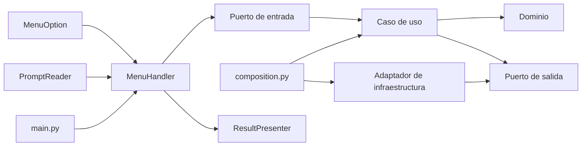

# Añadir una opción a la terminal

Esta guía explica cómo extender el menú sin mezclar presentación, aplicación,
dominio e infraestructura. Una opción debe tocar únicamente las capas que
tienen una responsabilidad real en su comportamiento.

## Resumen rápido

| Tipo de cambio | Producción | Tests |
| --- | ---: | ---: |
| Reutilizar un caso de uso y una salida | 2 archivos | 1–2 archivos |
| Reutilizar un caso de uso con una entrada nueva | 3–4 archivos | 2–3 archivos |
| Mostrar un resultado nuevo | 3–5 archivos | 2–4 archivos |
| Añadir una capacidad completa | 6–10 archivos | 4–7 archivos |

## Cómo viaja una opción



- `MenuRenderer` recorre `MenuOption`: una opción nueva aparece sin editar el
  renderer.
- `ConsolePrompts` recibe los IDs válidos y solo cambia si aparece una entrada
  interactiva diferente.
- `MenuHandler.execute_option` aplica progreso, presenta errores y entrega el
  resultado al presentador.
- `composition.py` construye gateways, stores, writers y casos de uso.
- `main.py` conecta los servicios ya construidos con adaptadores de terminal.

## Antes de escribir código

Responde:

1. ¿La opción llama a una capacidad que ya existe?
2. ¿Necesita pedir un dato nuevo?
3. ¿Devuelve un tipo que el presentador ya representa?
4. ¿Introduce invariantes de negocio?
5. ¿Necesita HTTP, archivos u otro efecto externo?

| Necesidad | Ubicación |
| --- | --- |
| Nombre, categoría e ID | `presentation/menu/options.py` |
| Asociación opción → acción | `presentation/cli_entrypoint.py` |
| Entrada interactiva | `presentation/ports.py` y `console_output/prompts.py` |
| Puerto de entrada | `application/ports/use_cases.py` |
| Orquestación | `application/use_cases/` |
| Estado y reglas | `domain/` |
| Efecto externo | puerto en `application/ports/` y adaptador en `infrastructure/` |
| Representación visual | `presentation/console_output/` |
| Ensamblado concreto | `composition.py` |

## Caso 1: reutilizar una capacidad existente

Para mostrar el resumen de la semana anterior,
`ActivitySummaryService.generate_summary` ya acepta `previous_week`.

### 1. Declarar la opción

En [options.py](../src/presentation/menu/options.py):

```python
class MenuOption(Enum):
    # Opciones existentes...
    PREVIOUS_WEEK_REPORT = (
        11,
        MenuCategory.INSIGHTS,
        "Previous-week training summary",
    )
```

El ID debe ser único y estable. Evita renumerar opciones publicadas.

### 2. Registrar la acción

En [cli_entrypoint.py](../src/presentation/cli_entrypoint.py):

```python
def _init_menu_options(self) -> None:
    self._menu_options: dict[MenuOption, MenuAction] = {
        # Acciones existentes...
        MenuOption.WEEKLY_REPORT: partial(
            self._generate_weekly_report,
            previous_week=False,
        ),
        MenuOption.PREVIOUS_WEEK_REPORT: partial(
            self._generate_weekly_report,
            previous_week=True,
        ),
    }


async def _generate_weekly_report(self, *, previous_week: bool) -> None:
    if self.dependencies.summary is None:
        raise RuntimeError("No weekly summary service has been configured.")
    summary = await self.dependencies.summary.generate_summary(
        previous_week=previous_week
    )
    self.dependencies.summary_presenter.present_weekly_report(summary)
```

`partial` evita dos handlers idénticos. No cambian dominio, infraestructura,
composición, prompts ni renderer.

### 3. Probar el dispatch

```python
@pytest.mark.parametrize(
    ("option", "previous_week"),
    [
        (MenuOption.WEEKLY_REPORT, False),
        (MenuOption.PREVIOUS_WEEK_REPORT, True),
    ],
)
@pytest.mark.asyncio
async def test_weekly_report_selects_period(
    option: MenuOption,
    previous_week: bool,
    menu_handler: MenuHandler,
    summary: Mock,
) -> None:
    await menu_handler.execute_option(str(option.id))

    summary.generate_summary.assert_awaited_once_with(previous_week=previous_week)
```

Actualiza también el test que garantiza IDs únicos.

## Caso 2: reutilizar el caso de uso y pedir datos

Una opción para consultar y guardar zonas cardiacas reutiliza
`PromptReader.ask_activity_id` y `ActivityZonesUseCase`:

```python
class MenuOption(Enum):
    # Opciones existentes...
    SAVE_ACTIVITY_ZONES = (
        11,
        MenuCategory.INSIGHTS,
        "Save heart-rate zones as JSON",
    )
```

```python
def _init_menu_options(self) -> None:
    self._menu_options: dict[MenuOption, MenuAction] = {
        # Acciones existentes...
        MenuOption.SAVE_ACTIVITY_ZONES: self._handle_save_activity_zones,
    }


async def _handle_save_activity_zones(self) -> object:
    activity_id = self.dependencies.prompts.ask_activity_id()
    return await self.dependencies.activity_zones.get_activity_zones(
        activity_id,
        save_zones=True,
    )
```

No se añade un prompt ni infraestructura: `build_application_services` ya
inyecta `JsonActivityZonesWriter`.

```python
@pytest.mark.asyncio
async def test_save_zones_uses_prompted_activity_id(
    menu_handler: MenuHandler,
    activity_zones: Mock,
    prompts: Mock,
) -> None:
    prompts.ask_activity_id.return_value = 123

    await menu_handler.execute_option(str(MenuOption.SAVE_ACTIVITY_ZONES.id))

    activity_zones.get_activity_zones.assert_awaited_once_with(
        123,
        save_zones=True,
    )
```

Si la opción necesita un dato distinto, amplía `PromptReader`, implementa la
lectura y validación en `ConsolePrompts` y prueba los reintentos de forma
aislada. El handler debe recibir valores ya validados.

## Caso 3: añadir una capacidad completa

Este ejemplo conceptual consulta el perfil del atleta.

### 1. Crear el modelo

`src/domain/athlete_profile.py`:

```python
from dataclasses import dataclass


@dataclass(frozen=True, slots=True)
class AthleteProfile:
    id: int
    first_name: str
    last_name: str

    def __post_init__(self) -> None:
        if isinstance(self.id, bool) or not isinstance(self.id, int):
            raise TypeError("Athlete id must be an integer.")
        if self.id <= 0:
            raise ValueError("Athlete id must be positive.")
        if not self.first_name.strip() or not self.last_name.strip():
            raise ValueError("Athlete names cannot be empty.")
```

El dominio no recibe mappings ni conoce los nombres de campos de Strava.

### 2. Declarar el puerto de salida y el caso de uso

`src/application/ports/athlete_gateway.py`:

```python
from typing import Protocol

from src.domain.athlete_profile import AthleteProfile


class AthleteGateway(Protocol):
    async def get_profile(self) -> AthleteProfile: ...
```

`src/application/use_cases/athlete_profile.py`:

```python
from src.application.ports.athlete_gateway import AthleteGateway
from src.domain.athlete_profile import AthleteProfile


class AthleteProfileService:
    def __init__(self, gateway: AthleteGateway) -> None:
        self._gateway = gateway

    async def get_profile(self) -> AthleteProfile:
        return await self._gateway.get_profile()
```

### 3. Adaptar Strava en infraestructura

`src/infrastructure/strava/athlete_mapper.py` valida el payload y crea el
modelo:

```python
from collections.abc import Mapping

from src.domain.athlete_profile import AthleteProfile


def map_athlete(payload: object) -> AthleteProfile:
    if not isinstance(payload, Mapping):
        raise TypeError("Strava athlete response must be an object.")
    athlete_id = payload.get("id")
    first_name = payload.get("firstname")
    last_name = payload.get("lastname")
    if isinstance(athlete_id, bool) or not isinstance(athlete_id, int):
        raise TypeError("Strava athlete id must be an integer.")
    if not isinstance(first_name, str) or not isinstance(last_name, str):
        raise TypeError("Strava athlete names must be strings.")
    return AthleteProfile(athlete_id, first_name, last_name)
```

`src/infrastructure/strava/athlete_gateway.py`:

```python
from src.domain.athlete_profile import AthleteProfile
from src.infrastructure.api_clients.async_strava_api import AsyncStravaAPI
from src.infrastructure.strava.athlete_mapper import map_athlete


class StravaAthleteGateway:
    def __init__(self, api: AsyncStravaAPI) -> None:
        self._api = api

    async def get_profile(self) -> AthleteProfile:
        return map_athlete(await self._api.make_request("/athlete"))
```

Toda traducción de HTTP queda fuera de aplicación y dominio.

### 4. Exponer un puerto de entrada pequeño

En [use_cases.py](../src/application/ports/use_cases.py):

```python
class AthleteProfileUseCase(Protocol):
    async def get_profile(self) -> AthleteProfile: ...
```

Añádelo a `MenuDependencies`:

```python
@dataclass(frozen=True, slots=True)
class MenuDependencies:
    # Dependencias existentes...
    athlete_profile: AthleteProfileUseCase
```

Cada acción conoce solo la capacidad que necesita; no se amplía un facade
monolítico.

### 5. Registrar y presentar

```python
async def _handle_athlete_profile(self) -> AthleteProfile:
    return await self.dependencies.athlete_profile.get_profile()
```

`ResultConsolePrinter` puede despachar el nuevo tipo a un método específico.
Si crecen muchos resultados, extrae un presentador por capacidad en lugar de
alargar indefinidamente una cadena de `isinstance`.

### 6. Componer

En `src/composition.py`, añade el servicio a `ApplicationServices` y
constrúyelo con `StravaAthleteGateway`:

```python
athlete_profile = AthleteProfileService(StravaAthleteGateway(api))
```

En `main.py` solo se pasa `services.athlete_profile` a
`MenuDependencies`. Ni `main.py` ni presentación construyen el gateway.

### 7. Probar cada responsabilidad

Como mínimo:

- dominio: valores válidos, tipos erróneos, ID no positivo y nombres vacíos;
- mapper: payload válido y formas/tipos externos inválidos;
- gateway: endpoint correcto y delegación al mapper;
- caso de uso: delegación al puerto;
- menú: dispatch al puerto de entrada;
- presentación: contenido visible;
- composición: servicio construido e inyectado.

Ningún test necesita credenciales o red real.

## Consideraciones al consultar Strava

1. **Permisos OAuth.** Si cambia el scope, actualiza
   `StravaAuthorizationConfig` y sus tests. Los tokens existentes requerirán
   autorización nueva.
2. **Paginación.** Sigue el patrón de
   `StravaActivityGateway.list_activities`: continúa hasta recibir una página
   incompleta.
3. **Concurrencia.** Usa `map_concurrently` para lotes y conserva el límite
   inyectable.
4. **Fallos parciales.** Decide si un fallo cancela la operación o se representa
   como resultado parcial, como hace `StreamBatch`.

Timeouts, reintentos y respuestas 5xx pertenecen a `AsyncHTTPClient`; un caso
de uso no duplica esa política.

## Resultados y errores

Una acción async devuelve un modelo o colección que `ResultPresenter` pueda
mostrar, o `None` si delega en un presentador especializado. Los errores se
propagan hasta `MenuHandler.execute_option`, que informa sin cerrar la sesión.

Captura una excepción dentro del caso de uso solo si puede recuperarse o
traducirse a un error de aplicación útil, conservando la causa con
`raise ... from error`.

## Checklist

- [ ] La opción tiene un ID único y estable.
- [ ] Está registrada en `MenuHandler`.
- [ ] Presentación solo conoce puertos de entrada y modelos de salida.
- [ ] Aplicación no importa infraestructura.
- [ ] Payloads externos se validan y mapean en infraestructura.
- [ ] Las implementaciones concretas se conectan en `composition.py`.
- [ ] Los errores llegan a la frontera apropiada.
- [ ] Tests no requieren credenciales ni red.
- [ ] Caminos nominales, límites y errores están cubiertos.
- [ ] `make check` y `uv lock --check` terminan correctamente.
