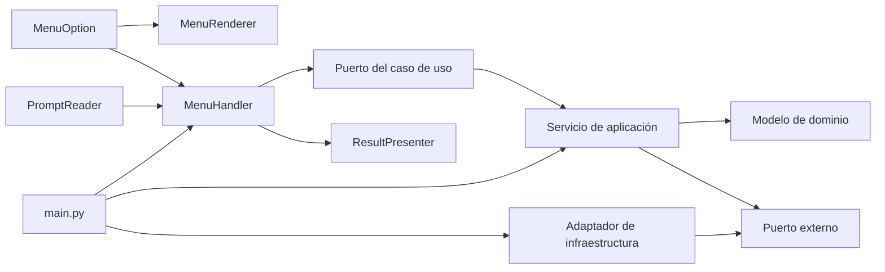

# Añadir una opción a la terminal

Esta guía explica cómo extender el menú sin mezclar presentación, lógica de
aplicación e infraestructura. No todas las opciones necesitan atravesar todas
las capas: el número de archivos depende de si se reutiliza un caso de uso, se
pide una entrada nueva o se introduce un concepto de dominio nuevo.

## Resumen rápido

| Tipo de cambio | Producción | Tests | Tamaño orientativo |
| --- | ---: | ---: | ---: |
| Reutilizar un caso de uso y una salida existentes | 2 archivos | 1–2 archivos | 10–40 líneas |
| Reutilizar el caso de uso con una entrada nueva | 3–4 archivos | 2–3 archivos | 30–80 líneas |
| Mostrar un tipo de resultado nuevo | 3–5 archivos | 2–4 archivos | 50–140 líneas |
| Añadir una capacidad de negocio completa | 5–8 archivos | 3–6 archivos | 100–250 líneas |

Estas cifras son una referencia, no un objetivo. Una opción debe tocar solo las
capas que tengan una responsabilidad real en su comportamiento.

Los tres casos siguientes son alternativas independientes. Todos utilizan el
ID `11` para representar cuál sería la siguiente opción actual; si se aplican
varios a la vez, cada uno debe recibir un ID diferente.

## Cómo viaja una opción por la aplicación



El flujo existente automatiza varias tareas:

- [`MenuRenderer`](../src/presentation/menu/renderer.py) recorre
  `MenuOption`, por lo que una opción nueva aparece sin editar el renderer.
- [`ConsolePrompts`](../src/presentation/console_output/prompts.py) recibe el
  conjunto de IDs válidos; tampoco necesita cambios si la opción no introduce
  una entrada distinta.
- [`MenuHandler.execute_option`](../src/presentation/cli_entrypoint.py) aplica
  el spinner, presenta los errores y envía el resultado al presentador para
  todas las opciones.
- [`main.py`](../main.py) solo cambia cuando hay que construir una dependencia
  nueva.

La parte deliberadamente explícita es el registro que relaciona cada
`MenuOption` con una acción. Así se puede revisar el catálogo completo de
comandos en un único lugar.

## Antes de escribir código

Responde estas preguntas para determinar el alcance:

1. ¿La opción llama a un método que ya existe?
2. ¿Necesita pedir información nueva al usuario?
3. ¿Devuelve un tipo que `ResultConsolePrinter` ya sabe representar?
4. ¿Introduce un concepto con invariantes propias?
5. ¿Necesita red, archivos u otro efecto externo nuevo?

La primera respuesta afirmativa de cada bloque determina qué piezas añadir:

| Necesidad | Ubicación |
| --- | --- |
| Nombre, categoría e ID | `presentation/menu/options.py` |
| Asociación opción → acción | `presentation/cli_entrypoint.py` |
| Entrada interactiva nueva | `presentation/ports.py` y `console_output/prompts.py` |
| Orquestación nueva | `core/` |
| Estado y reglas nuevas | `domain/` |
| HTTP, archivos o servicio externo nuevo | puerto en `core/ports/` y adaptador en `infrastructure/` |
| Representación visual nueva | `console_output/` y su puerto de presentación |
| Dependencia concreta nueva | `main.py` |

## Caso 1: reutilizar una capacidad existente

Como ejemplo, se añadirá una opción para generar el resumen de la semana
anterior. `ActivitySummaryService.generate_summary` ya acepta
`previous_week`, y el presentador semanal ya existe. Solo hay que exponer esa
variante en la terminal.

### 1. Declarar la opción

En [`src/presentation/menu/options.py`](../src/presentation/menu/options.py):

```python
class MenuOption(Enum):
    # Opciones existentes...
    WEEKLY_REPORT = (9, MenuCategory.INSIGHTS, "Weekly training summary")
    ACTIVITY_ZONES = (10, MenuCategory.INSIGHTS, "View heart-rate zones")
    PREVIOUS_WEEK_REPORT = (
        11,
        MenuCategory.INSIGHTS,
        "Previous-week training summary",
    )
```

El ID debe ser único y estable. Evita renumerar opciones publicadas: los
usuarios pueden haberse acostumbrado a ellas y los scripts interactivos pueden
depender de esos números.

Si se necesita una sección nueva, añade primero un valor a `MenuCategory`. El
renderer la mostrará automáticamente.

### 2. Registrar la acción

En [`src/presentation/cli_entrypoint.py`](../src/presentation/cli_entrypoint.py),
convierte el handler semanal en una operación parametrizable:

```python
def _init_menu_options(self) -> None:
    self._menu_options: dict[MenuOption, MenuAction] = {
        # Acciones existentes...
        MenuOption.WEEKLY_REPORT: partial(
            self._generate_weekly_report,
            previous_week=False,
        ),
        MenuOption.PREVIOUS_WEEK_REPORT: partial(
            self._generate_weekly_report,
            previous_week=True,
        ),
    }


async def _generate_weekly_report(self, *, previous_week: bool) -> None:
    if self.dependencies.summary_service is None:
        raise RuntimeError("No weekly summary service has been configured.")
    summary = await self.dependencies.summary_service.generate_summary(
        previous_week=previous_week
    )
    self.dependencies.summary_presenter.present_weekly_report(summary)
```

`functools.partial` evita dos métodos casi idénticos. El handler sigue teniendo
una sola responsabilidad: coordinar el caso de uso y su presentador.

No hay que modificar `main.py`, los puertos, el dominio, la infraestructura,
los prompts ni el renderer.

### 3. Actualizar los tests

El test de IDs en
[`tests/test_menu_options.py`](../tests/test_menu_options.py) debe incluir el
nuevo número:

```python
def test_menu_options_have_stable_unique_ids() -> None:
    ids = [option.id for option in MenuOption]

    assert ids == list(range(1, 12))
    assert len(ids) == len(set(ids))
```

Conviene probar ambas variantes mediante parametrización en
[`tests/test_menu.py`](../tests/test_menu.py):

Primero crea un `summary_service` reutilizable e inyéctalo en la fixture
`menu_handler` en lugar del valor `None` actual:

```python
@pytest.fixture
def summary_service() -> Mock:
    service = Mock(spec=ActivitySummaryService)
    service.generate_summary = AsyncMock(
        return_value=WeeklyActivitySummary.from_activities([])
    )
    return service
```

```python
@pytest.mark.parametrize(
    ("option", "previous_week"),
    [
        (MenuOption.WEEKLY_REPORT, False),
        (MenuOption.PREVIOUS_WEEK_REPORT, True),
    ],
)
@pytest.mark.asyncio
async def test_weekly_report_selects_period(
    option: MenuOption,
    previous_week: bool,
    menu_handler: MenuHandler,
    summary_service: Mock,
) -> None:
    await menu_handler.execute_option(str(option.id))

    summary_service.generate_summary.assert_awaited_once_with(
        previous_week=previous_week
    )
```

El ejemplo completo afecta a dos archivos de producción y dos de tests.

## Caso 2: reutilizar el caso de uso, pero pedir datos

Una opción para consultar y guardar las zonas cardiacas puede reutilizar
`ask_activity_id` y `StravaService.get_activity_zones`:

```python
class MenuOption(Enum):
    # Opciones existentes...
    SAVE_ACTIVITY_ZONES = (
        11,
        MenuCategory.INSIGHTS,
        "Save heart-rate zones as JSON",
    )
```

```python
def _init_menu_options(self) -> None:
    self._menu_options: dict[MenuOption, MenuAction] = {
        # Acciones existentes...
        MenuOption.SAVE_ACTIVITY_ZONES: self._handle_save_activity_zones,
    }


async def _handle_save_activity_zones(self) -> object:
    activity_id = self.dependencies.prompts.ask_activity_id()
    return await self.dependencies.service.get_activity_zones(
        activity_id,
        save_zones=True,
    )
```

No se añade un prompt nuevo, porque el contrato ya ofrece
`ask_activity_id() -> int`. Tampoco se modifica la infraestructura: el writer
JSON ya se inyecta en `StravaService` desde `main.py`.

El test del dispatch debe verificar tanto el ID leído como el argumento
nombrado:

```python
@pytest.mark.asyncio
async def test_save_zones_uses_prompted_activity_id(
    menu_handler: MenuHandler,
    mock_service: Mock,
    mock_prompts: Mock,
) -> None:
    mock_prompts.ask_activity_id.return_value = 123

    await menu_handler.execute_option(str(MenuOption.SAVE_ACTIVITY_ZONES.id))

    mock_service.get_activity_zones.assert_awaited_once_with(
        123,
        save_zones=True,
    )
```

### Cuándo sí hay que crear un prompt

Si la opción pide un dato distinto, amplía primero el puerto `PromptReader`:

```python
class PromptReader(Protocol):
    # Operaciones existentes...
    def ask_output_directory(self) -> Path: ...
```

Después implementa esa operación en `ConsolePrompts`, incluyendo validación y
mensajes de reintento, y añade tests aislados del input. `MenuHandler` debe
recibir el valor ya validado; no debería analizar strings ni conocer detalles
de Rich.

## Caso 3: añadir una capacidad completa

Este ejemplo conceptual añade la consulta del perfil del atleta. Introduce un
modelo, un servicio de aplicación, un puerto de presentación y una vista nueva.

### 1. Crear el modelo de dominio

`src/domain/athlete_profile.py`:

```python
from collections.abc import Mapping
from dataclasses import dataclass
from typing import Self


@dataclass(frozen=True, slots=True)
class AthleteProfile:
    id: int
    first_name: str
    last_name: str

    def __post_init__(self) -> None:
        if isinstance(self.id, bool) or not isinstance(self.id, int):
            raise TypeError("Athlete id must be an integer.")
        if self.id <= 0:
            raise ValueError("Athlete id must be positive.")
        for field_name, value in (
            ("first_name", self.first_name),
            ("last_name", self.last_name),
        ):
            if not isinstance(value, str):
                raise TypeError(f"Athlete {field_name} must be a string.")
            if not value.strip():
                raise ValueError(f"Athlete {field_name} cannot be empty.")

    @classmethod
    def from_mapping(cls, payload: Mapping[str, object]) -> Self:
        athlete_id = payload.get("id")
        first_name = payload.get("firstname")
        last_name = payload.get("lastname")
        if isinstance(athlete_id, bool) or not isinstance(athlete_id, int):
            raise TypeError("Athlete id must be an integer.")
        if not isinstance(first_name, str) or not isinstance(last_name, str):
            raise TypeError("Athlete names must be strings.")
        return cls(athlete_id, first_name, last_name)
```

La conversión desde datos externos vive en el modelo, pero la comprobación de
que la respuesta HTTP es un objeto corresponde a la frontera del caso de uso.

### 2. Crear el servicio de aplicación

`src/core/athletes/service.py`:

```python
from collections.abc import Mapping
from typing import cast

from src.core.ports.strava import StravaAPI
from src.domain.athlete_profile import AthleteProfile


class AthleteProfileService:
    def __init__(self, api: StravaAPI) -> None:
        self._api = api

    async def get_profile(self) -> AthleteProfile:
        response = await self._api.make_request("/athlete")
        if not isinstance(response, Mapping):
            raise TypeError("Strava athlete response must be an object.")
        return AthleteProfile.from_mapping(cast(Mapping[str, object], response))
```

No hace falta cambiar `AsyncStravaAPI`, porque su puerto ya permite consultar
cualquier endpoint de Strava. Si la nueva capacidad dependiera de otro sistema,
habría que declarar un puerto específico en `core/ports` e implementarlo en
`infrastructure`.

### 3. Exponer un contrato pequeño a presentación

En [`src/presentation/ports.py`](../src/presentation/ports.py):

```python
class AthleteProfileUseCase(Protocol):
    async def get_profile(self) -> AthleteProfile: ...
```

Después se añade a `MenuDependencies`:

```python
@dataclass(frozen=True, slots=True)
class MenuDependencies:
    # Dependencias existentes...
    athlete_profile: AthleteProfileUseCase
```

Es preferible un protocolo pequeño y cohesivo a seguir ampliando
`StravaUseCases` con capacidades no relacionadas. Esto aplica segregación de
interfaces y facilita construir dobles de test precisos.

### 4. Registrar el comando

```python
class MenuOption(Enum):
    # Opciones existentes...
    ATHLETE_PROFILE = (11, MenuCategory.INSIGHTS, "View athlete profile")
```

```python
def _init_menu_options(self) -> None:
    self._menu_options: dict[MenuOption, MenuAction] = {
        # Acciones existentes...
        MenuOption.ATHLETE_PROFILE: self._handle_athlete_profile,
    }


async def _handle_athlete_profile(self) -> AthleteProfile:
    return await self.dependencies.athlete_profile.get_profile()
```

La acción no conoce URLs, JSON, Rich ni credenciales. Solo coordina el puerto
que necesita.

### 5. Presentar el resultado

Para seguir el patrón actual, `ResultConsolePrinter.print_result` puede
despachar el modelo nuevo:

```python
elif isinstance(result, AthleteProfile):
    self._print_athlete_profile(result)
```

```python
def _print_athlete_profile(self, profile: AthleteProfile) -> None:
    table = Table(title="Athlete profile", title_style="heading")
    table.add_column("Field", style="accent")
    table.add_column("Value")
    table.add_row("ID", str(profile.id))
    table.add_row("Name", f"{profile.first_name} {profile.last_name}")
    self._console.print(table)
```

Si empiezan a aparecer muchos tipos nuevos, no conviene seguir aumentando la
cadena de `isinstance`. En ese momento se debe extraer un presentador por
capacidad o un registro de renderers tipados. Para una sola vista adicional,
el patrón actual sigue siendo sencillo y explícito.

### 6. Componer las dependencias

`main.py` es el único lugar que debe conocer la implementación concreta:

```python
athlete_profile = AthleteProfileService(api=strava_api)

menu = MenuHandler(
    MenuDependencies(
        # Dependencias existentes...
        athlete_profile=athlete_profile,
    )
)
```

No construyas `AthleteProfileService` dentro de `MenuHandler`. Hacerlo acoplaría
la presentación a una implementación y complicaría los tests.

### 7. Cubrir cada responsabilidad

Como mínimo, añade:

- tests del modelo: payload válido, tipos erróneos, ID no positivo y nombres
  vacíos;
- tests del servicio: endpoint correcto, respuesta no-mapping y conversión al
  modelo;
- test de dispatch: la opción llama una vez al caso de uso inyectado;
- test de presentación: la tabla contiene ID y nombre;
- test de composición: `main.py` inyecta el nuevo servicio.

Ejemplo del servicio sin red real:

```python
@pytest.mark.asyncio
async def test_get_profile_builds_domain_model() -> None:
    api = Mock()
    api.make_request = AsyncMock(
        return_value={"id": 7, "firstname": "Alex", "lastname": "Runner"}
    )
    service = AthleteProfileService(api)

    result = await service.get_profile()

    assert result == AthleteProfile(7, "Alex", "Runner")
    api.make_request.assert_awaited_once_with("/athlete")
```

Este test verifica comportamiento y contrato sin `client_id`, `client_secret`
ni acceso a Strava.

## Consideraciones al consultar Strava

Antes de añadir un endpoint, revisa cuatro aspectos:

1. **Permisos OAuth.** Si requiere un scope que aún no se solicita, actualiza
   el parámetro `scope` del flujo de autorización y sus tests. Los tokens ya
   guardados no adquieren permisos nuevos al renovarse: el usuario tendrá que
   invalidarlos y autorizar de nuevo.
2. **Paginación.** Una colección no debe asumir que cabe en una sola respuesta.
   Sigue el patrón de `WeeklyActivitiesFetcher`, incrementando la página hasta
   recibir menos elementos que el tamaño solicitado.
3. **Concurrencia.** Para consultar muchos recursos, utiliza
   `map_concurrently`; no lances un `asyncio.gather` sin límite. Conserva el
   límite configurable para poder probarlo.
4. **Fallos parciales.** Decide explícitamente si un elemento fallido debe
   cancelar toda la operación o producir un resultado parcial como
   `StreamBatch`. No descartes errores silenciosamente.

Timeouts, reintentos de conexión y respuestas 5xx ya pertenecen a
`AsyncHTTPClient`. Un caso de uso nuevo no debe duplicar esa política.

## Tratamiento de resultados y errores

Una acción registrada debe ser async y devolver uno de estos resultados:

- un modelo o colección que `ResultPresenter` pueda mostrar;
- `None` si ella misma delega en un presentador especializado, como el resumen
  semanal.

Los errores de dominio o infraestructura deben propagarse hasta
`MenuHandler.execute_option`. Esa frontera los presenta sin cerrar la sesión.
No añadas `try/except Exception` dentro de cada handler; captura excepciones
concretas únicamente cuando el caso de uso pueda recuperarse o traducirlas con
contexto útil.

Las entradas inválidas sí se resuelven dentro de `ConsolePrompts`, porque allí
puede pedirse el valor de nuevo sin iniciar una operación remota.

## Pruebas obligatorias por escenario

| Cambio | Pruebas mínimas |
| --- | --- |
| Nueva opción | ID único, categoría y descripción |
| Nuevo registro | dispatch al callable correcto |
| Parámetros | valores exactos enviados al caso de uso |
| Prompt nuevo | válido, vacío, tipo incorrecto y reintento |
| Modelo nuevo | construcción válida y todas sus invariantes |
| Caso de uso nuevo | resultado, endpoint y errores de frontera |
| Resultado nuevo | contenido visible y casos vacíos |
| Dependencia nueva | composición de `main.py` |
| Nuevo paquete/import | contratos de import-linter |

Evita comprobar detalles internos sin valor observable. Por ejemplo, es mejor
afirmar que una opción llama al puerto correcto que comparar la implementación
completa del diccionario privado `_menu_options`.

## Fallos habituales

- **Añadir el enum pero olvidar el registro:** la opción aparece en pantalla,
  pero falla al ejecutarse. Un test de dispatch debe detectarlo.
- **Devolver un tipo desconocido:** el presentador cae en “No data available”.
  Añade una representación explícita o un presentador especializado.
- **Validar payloads en la terminal:** duplica reglas y permite que otros
  adaptadores creen estados inválidos. Valida en la frontera y en el dominio.
- **Instanciar infraestructura desde presentación:** rompe la inversión de
  dependencias y el contrato de import-linter.
- **Ampliar un protocolo sin necesidad:** obliga a todos sus dobles y
  adaptadores a conocer métodos que no utilizan.
- **Usar red en los tests:** vuelve la suite lenta, frágil y dependiente de
  secretos. Sustituye los puertos por mocks o fakes.
- **Capturar todos los errores dentro del caso de uso:** oculta fallos y pierde
  contexto. Traduce solo excepciones conocidas y conserva la causa con
  `raise ... from error`.

## Cuándo evolucionar el diseño del menú

Con el tamaño actual, un `Enum` y un mapa explícito son fáciles de entender. Si
el menú supera aproximadamente 15–20 acciones, varias opciones repiten la misma
preparación o distintos plugins necesitan registrar comandos, puede extraerse
un registro:

```python
from collections.abc import Awaitable, Callable, Mapping
from dataclasses import dataclass

type MenuAction = Callable[[], Awaitable[object]]


@dataclass(frozen=True, slots=True)
class MenuCommand:
    option: MenuOption
    execute: MenuAction


class CommandRegistry:
    def __init__(self, commands: tuple[MenuCommand, ...]) -> None:
        self._commands: Mapping[MenuOption, MenuAction] = {
            command.option: command.execute for command in commands
        }

    def resolve(self, option: MenuOption) -> MenuAction:
        return self._commands[option]
```

No introduzcas esta abstracción para una sola opción: añadir tipos y fábricas
sin una necesidad concreta aumenta el coste de lectura sin mejorar SOLID.

## Checklist antes de abrir la PR

- [ ] La opción tiene un ID único y no renumera opciones existentes.
- [ ] Está registrada en `MenuHandler`.
- [ ] La presentación solo conoce puertos, no adaptadores concretos.
- [ ] Los datos externos se convierten en modelos validados.
- [ ] El tipo de retorno está representado correctamente.
- [ ] Los errores llegan a la frontera apropiada.
- [ ] Los scopes OAuth, paginación y política de fallos están revisados.
- [ ] No se necesitan credenciales ni red para ejecutar los tests.
- [ ] Los nuevos caminos nominales y de error tienen pruebas.
- [ ] La documentación de usuario refleja la nueva capacidad.
- [ ] `make check` y `uv lock --check` terminan correctamente.

Mantén en commits distintos el modelo/caso de uso, la integración de terminal y
los tests cuando cada bloque pueda revisarse de forma independiente.
