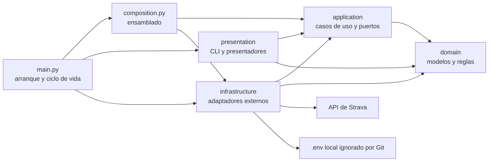

# Arquitectura

Strava Analysis separa dominio, aplicación, infraestructura y presentación.
Las dependencias apuntan hacia dentro y `src/composition.py` es el único módulo
que construye adaptadores concretos y los conecta con casos de uso.

Presentación e infraestructura no se conocen entre sí. Ambas dependen de
contratos de aplicación o de dominio y se conectan únicamente desde
`composition.py`. `main.py` limita su responsabilidad al arranque, el ciclo
de vida del cliente HTTP y la construcción de los adaptadores de terminal.

## Responsabilidad de cada capa

| Capa | Responsabilidad | Ejemplos |
| --- | --- | --- |
| `domain` | Estados válidos y reglas puras | `DetailedActivity`, `ActivityStream`, `WeekPeriod`, `TokenSet` |
| `application` | Casos de uso, puertos y resultados | consultas semanales, exportación, resumen y OAuth |
| `infrastructure` | I/O y traducción de sistemas externos | HTTP, Strava, OAuth, CSV, JSON, logging y token local |
| `presentation` | Entrada y salida de terminal | menú, prompts, tablas, errores y progreso |
| `composition.py` | Construcción y conexión de implementaciones | gateways, stores, writers y servicios |
| `main.py` | Bootstrap y ciclo de vida | token, cliente API, consola y bucle del menú |

No existe un cajón genérico transversal. Cada concepto vive junto a la capa que
lo posee: los errores del contrato están en `application.errors`, el logging en
`infrastructure.logging` y los cálculos semanales en `domain.week_period`.

## Dominio y límites de confianza

Las respuestas de Strava entran como `object`. Los mapeadores de
`infrastructure/strava` comprueban su forma y las convierten de inmediato a
modelos de dominio inmutables (`@dataclass(frozen=True, slots=True)`). Ni
aplicación ni presentación reciben diccionarios de la API.

Los modelos protegen invariantes como:

- identificadores positivos;
- distancias, tiempos y métricas finitas no negativas;
- coherencia entre tiempo transcurrido y tiempo en movimiento;
- exactamente cinco zonas cardiacas;
- muestras de streams sincronizadas aunque falte una serie;
- tokens completos con una fecha de expiración válida.

`StreamBatch` conserva por separado los streams obtenidos y cada
`StreamFetchFailure`. Un fallo parcial no descarta resultados válidos ni se
confunde con un lote completamente correcto.

## Puertos y adaptadores

Los límites se expresan con `typing.Protocol`, sin herencia nominal:

- `ActivityGateway` expone a los casos de uso actividades, detalles, streams y
  zonas ya convertidos al dominio;
- `StreamExporter` y `ActivityZonesWriter` abstraen la escritura;
- `TokenStore`, `TokenGateway` y `AuthorizationCodeProvider` aíslan OAuth;
- `ActivityQueries`, `ActivityStreamQueries`, `StreamExportUseCase`,
  `ActivityZonesUseCase` y `WeeklySummaryUseCase` son puertos de entrada
  pequeños que consume el menú;
- `ResultPresenter`, `PromptReader`, `MenuView` y `OperationProgress`
  pertenecen a presentación.

El tipado estructural permite dobles sencillos y adaptadores independientes. Un
adaptador traduce excepciones y payloads externos en conceptos internos antes
de cruzar el puerto.

## Flujo de una operación

1. `main.py` obtiene el token con el servicio construido por composición.
2. Abre un único `AsyncStravaAPI` y pide a composición los servicios.
3. Construye `MenuDependencies` con un puerto específico por capacidad.
4. `MenuHandler` valida la opción, pide parámetros e invoca el caso de uso.
5. El caso de uso orquesta el dominio a través de un gateway.
6. Infraestructura valida y transforma la respuesta externa.
7. El presentador muestra el resultado; un error de operación no cierra la
   sesión.

## Acceso a Strava y concurrencia

`AsyncHTTPClient` reutiliza una `aiohttp.ClientSession`, aplica timeout y
reintenta conexiones, timeouts y respuestas 5xx con espera incremental. Los
errores 4xx conocidos se traducen a errores de aplicación y no se reintentan.

`StravaActivityGateway` pagina de 200 en 200 hasta recibir una página
incompleta. Los detalles y streams usan `map_concurrently`, que conserva el
orden y limita a cinco las peticiones simultáneas por defecto. El límite es
inyectable para poder configurarlo y probarlo.

## Contratos automatizados

`.importlinter` comprueba con `make architecture` que:

- `presentation → application → domain`;
- `infrastructure → application → domain`;
- presentación e infraestructura son independientes;
- dominio no depende de capas externas;
- ninguna capa interna depende de `composition.py`.

`make check` ejecuta estos contratos junto a Ruff, formato, `ty` y pytest con
cobertura de ramas.
