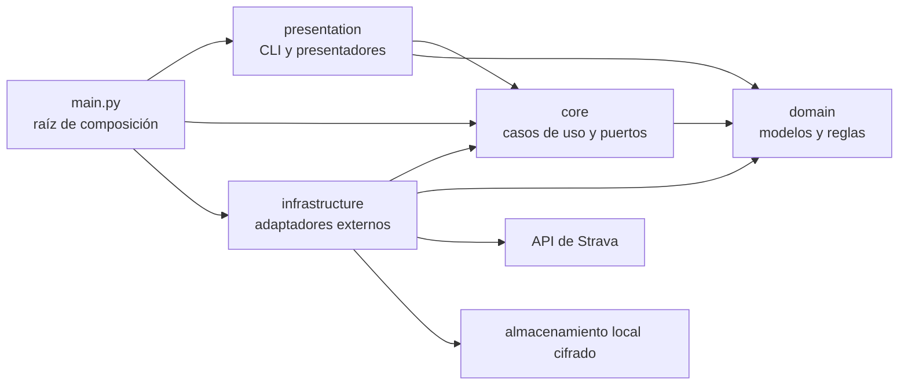

# Arquitectura

Strava Analysis sigue una arquitectura por capas con dependencias dirigidas
hacia el dominio. `main.py` es la raíz de composición: crea los adaptadores
concretos y los inyecta en los casos de uso y en la interfaz de terminal.

El dominio no conoce ninguna capa externa. Presentación e infraestructura
tampoco se conocen entre sí: ambas se conectan mediante contratos definidos
por la capa que consume la funcionalidad.

## Responsabilidad de cada capa

| Capa | Responsabilidad | Ejemplos |
| --- | --- | --- |
| `domain` | Representar estados válidos y reglas de negocio puras | `DetailedActivity`, `ActivityStream`, `HeartRateZones`, `TokenSet` |
| `core` | Orquestar casos de uso y declarar puertos | consulta semanal, exportación, resumen, OAuth |
| `infrastructure` | Implementar I/O y servicios externos | HTTP, API de Strava, CSV, JSON y tokens cifrados |
| `presentation` | Recoger entradas y presentar resultados | menú, prompts, tablas, errores y progreso |
| `main.py` | Construir e inyectar dependencias | cliente API, exportadores, servicios y CLI |

`src/utils` contiene únicamente elementos transversales pequeños, como
constantes, excepciones y configuración de logging. No debe convertirse en una
capa alternativa con lógica de negocio.

## Dominio y límites de confianza

Las respuestas de Strava entran como `object`. Los adaptadores y casos de uso
comprueban su forma y las convierten de inmediato a modelos de dominio
inmutables (`@dataclass(frozen=True, slots=True)`). De esta forma, el resto de
la aplicación no trabaja con diccionarios externos de estructura ambigua.

Los modelos protegen invariantes como:

- identificadores positivos;
- distancias, tiempos y métricas finitas no negativas;
- coherencia entre tiempo transcurrido y tiempo en movimiento;
- exactamente cinco zonas cardiacas;
- muestras de streams sincronizadas, incluso cuando falta alguna serie;
- tokens completos y con una fecha de expiración válida.

`StreamBatch` conserva por separado los streams obtenidos y cada
`StreamFetchFailure`. Un fallo parcial, por tanto, no se confunde con un lote
completamente correcto ni descarta los resultados válidos.

## Puertos, adaptadores y abstracciones

Los límites se expresan con `typing.Protocol` en lugar de clases base
abstractas. El tipado estructural permite que un adaptador satisfaga un
contrato por su comportamiento, sin heredar de una jerarquía ni depender de
una implementación concreta.

Los principales puertos son:

- `StravaAPI`, consumido por los casos de uso que consultan actividades,
  streams y zonas;
- `StreamExporter` y `ActivityZonesWriter`, consumidos por la exportación;
- `TokenStore`, `TokenGateway` y `AuthorizationCodeProvider`, consumidos por
  el flujo OAuth;
- los puertos de presentación (`ResultPresenter`, `PromptReader`, `MenuView`,
  etc.), consumidos por `MenuHandler`.

Esta elección facilita usar dobles sencillos en tests. Una clase base abstracta
solo sería preferible si varias implementaciones necesitaran compartir estado,
invariantes o comportamiento reutilizable; actualmente no existe esa
necesidad.

## Flujo de una operación de terminal

1. `main.py` obtiene un token y construye los adaptadores concretos.
2. `MenuHandler` valida la opción y solicita los parámetros interactivos.
3. La presentación invoca un puerto de caso de uso, sin construir
   infraestructura.
4. El caso de uso consulta el puerto de Strava y transforma la respuesta en
   objetos de dominio.
5. El presentador recibe esos objetos y genera tablas, paneles o mensajes.
6. La frontera de terminal captura un error no recuperable de la operación,
   lo presenta y mantiene viva la sesión.

El indicador de progreso envuelve únicamente el trabajo remoto. La validación
de entradas y el renderizado permanecen separados de la lógica de negocio.

## Acceso a Strava y concurrencia

`AsyncHTTPClient` reutiliza una única `aiohttp.ClientSession`, configura un
timeout total y reintenta errores de conexión, timeouts y respuestas 5xx con
espera incremental. Los errores 4xx conocidos se traducen a errores de la
aplicación y no se reintentan indiscriminadamente.

La consulta semanal pagina de 200 en 200 hasta recibir una página incompleta.
Las consultas de detalles y streams usan `map_concurrently`, que conserva el
orden de entrada y limita a cinco las peticiones simultáneas por defecto. El
límite se inyecta y puede ajustarse o probarse sin variables globales.

## Contratos automatizados

`.importlinter` verifica en cada ejecución de `make check` y en CI que:

- las dependencias respetan la dirección presentación → infraestructura →
  core → dominio permitida por el contrato general;
- presentación no construye adaptadores de infraestructura;
- presentación e infraestructura permanecen independientes;
- dominio no importa ninguna capa externa.

El contrato general admite que una capa exterior dependa de otra interior; los
contratos específicos endurecen los límites que deben permanecer totalmente
desacoplados.
