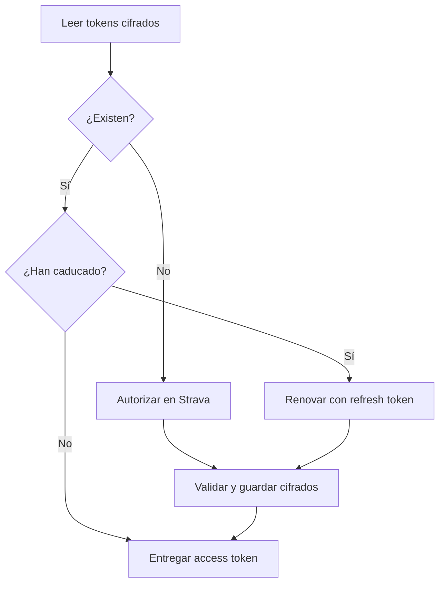

# Credenciales y almacenamiento de tokens

La aplicación no depende de Supabase ni de ninguna base de datos externa para
gestionar OAuth. Conserva un único juego de tokens cifrado en el equipo del
usuario y renueva el access token cuando caduca.

## Configuración

Las credenciales de la aplicación de Strava se leen del entorno:

```dotenv
STRAVA_CLIENT_ID=<client-id>
STRAVA_SECRET_KEY=<client-secret>
```

Puede usarse un archivo `.env` local, que está excluido por `.gitignore`. Nunca
se deben incluir valores reales en ejemplos, commits, imágenes Docker o logs.

`FERNET_KEY` es opcional. Si no se define, la aplicación genera una clave
aleatoria y privada en el directorio de configuración del usuario. Esta es la
opción recomendada para el uso local porque evita copiar la clave al
repositorio o al archivo `.env`.

## Archivos locales

De forma predeterminada se utilizan las rutas XDG:

| Contenido | Variable base | Ruta sin variable XDG |
| --- | --- | --- |
| Clave Fernet | `XDG_CONFIG_HOME` | `~/.config/strava-analysis/fernet.key` |
| Tokens cifrados | `XDG_DATA_HOME` | `~/.local/share/strava-analysis/tokens.enc` |
| Logs | `XDG_STATE_HOME` | `~/.local/state/strava-analysis/application.log` |

Los directorios de clave y tokens se crean con modo `0700`; los archivos se
guardan con `0600`. La escritura del token usa un archivo temporal y
`os.replace`, por lo que un proceso interrumpido no debería dejar el archivo
principal parcialmente escrito.

`tokens.enc`, `fernet.key`, `.env` y el directorio `.strava-analysis/` también
están ignorados como defensa adicional ante commits accidentales.

## Ciclo OAuth



La respuesta OAuth se valida como `TokenSet` antes de persistirse. Un archivo
ausente inicia la autorización; un archivo corrupto, una clave incorrecta o un
payload inválido producen un error explícito y no se interpretan como si no
hubiera credenciales.

## Aplicación inactiva en Strava

Si todas las consultas devuelven `403 Forbidden` y Strava informa de
`Application / Status / Inactive`, el token, los periodos y las opciones del
menú no son la causa: Strava ha desactivado la aplicación asociada al
`STRAVA_CLIENT_ID`.

Hay que comprobar su estado en <https://www.strava.com/settings/api>, confirmar
que el identificador y el secreto del `.env` pertenecen a esa aplicación y
completar cualquier paso de reactivación que solicite Strava. La
[guía oficial](https://developers.strava.com/docs/getting-started/) indica que
una suscripción de Strava es un requisito previo para registrar una aplicación
API. Si el panel no permite reactivarla aun teniendo la suscripción activa,
debe consultarse con el soporte para desarrolladores de Strava. Una vez activa,
puede ser necesario eliminar únicamente
`~/.local/share/strava-analysis/tokens.enc` y autorizar de nuevo. Eliminar o
mover el token antes de reactivar la aplicación no resuelve este error.

## Alcance de la protección

Fernet aporta confidencialidad e integridad al archivo de tokens. Evita que el
contenido quede legible en copias accidentales o backups del archivo aislado,
pero no protege frente a un usuario o proceso que pueda leer simultáneamente
el token y su clave dentro de la misma cuenta. Los permisos del sistema y la
protección de la sesión local siguen siendo necesarios.

Si se define `FERNET_KEY` en despliegues automatizados, debe proceder de un
gestor de secretos. Perder o cambiar la clave hace imposible descifrar el token
existente; en ese caso hay que eliminar las credenciales locales y completar
de nuevo la autorización.

## Contenedores

El contenedor es efímero salvo que se monten los directorios de datos y
configuración. Para mantener una sesión entre ejecuciones, conserva ambos:

```bash
docker run --rm --env-file .env -it \
  -v strava-data:/root/.local/share/strava-analysis \
  -v strava-config:/root/.config/strava-analysis \
  strava-analysis
```

Mantener solo el archivo cifrado sin su clave obliga a autorizar de nuevo. Como
alternativa, un despliegue puede inyectar una `FERNET_KEY` estable mediante su
gestor de secretos y persistir únicamente el volumen de datos.

## Pruebas de seguridad local

Los tests crean claves y archivos dentro de directorios temporales. Cubren
permisos, escritura atómica, datos manipulados, clave incorrecta, limpieza y
errores del sistema de archivos sin leer credenciales reales del desarrollador.
