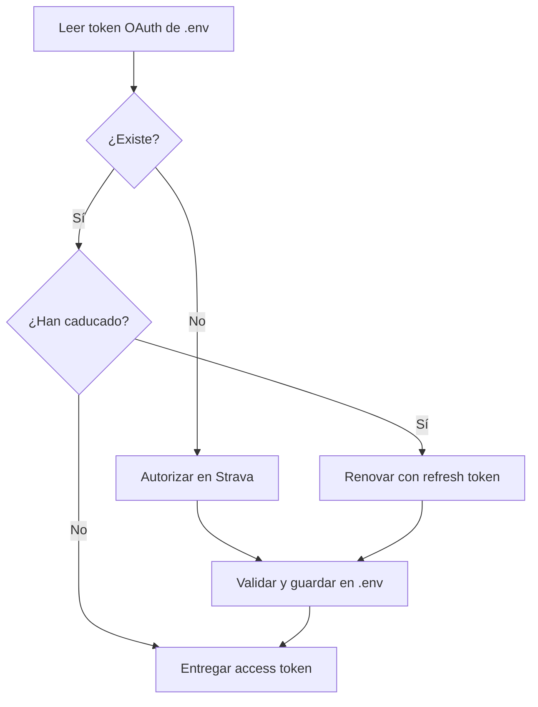

# Credenciales y almacenamiento de tokens

La aplicación no depende de Supabase ni de ninguna base de datos externa para
gestionar OAuth. En ejecución local conserva un único juego de tokens en el
`.env` del proyecto y renueva el access token cuando caduca. El contenedor usa
el mismo formato bajo su directorio de estado `/data`.

## Configuración

Las credenciales de la aplicación de Strava se leen del entorno:

```dotenv
STRAVA_CLIENT_ID=<client-id>
STRAVA_SECRET_KEY=<client-secret>
```

Puede usarse un archivo `.env` local, que está excluido por `.gitignore`. Nunca
se deben incluir valores reales en ejemplos, commits, imágenes Docker o logs.

Después de completar OAuth, la aplicación añade y actualiza automáticamente
una única variable:

```dotenv
STRAVA_OAUTH_TOKEN=<token-json-generado-por-la-aplicacion>
```

No debe copiarse ni editarse manualmente. El valor contiene el access token, el
refresh token y su fecha de expiración. Se guarda sin cifrado porque almacenar
el texto cifrado y su clave Fernet en el mismo `.env` no ofrecería protección
adicional y añadiría un punto de fallo. Para este modo local, la protección
depende de que `.env` permanezca fuera de Git y tenga permisos `0600`.

## Archivos locales

En ejecución local se utilizan estas rutas:

| Contenido | Ruta |
| --- | --- |
| Credenciales y token OAuth | `.env` en la raíz del proyecto |
| Logs | `$XDG_STATE_HOME/strava-analysis/application.log` o `~/.local/state/strava-analysis/application.log` |

La aplicación conserva las demás variables y comentarios al actualizar el
token. Rechaza enlaces simbólicos y restringe `.env` a `0600` antes de leer
credenciales o tokens. `python-dotenv` realiza las actualizaciones mediante un
archivo temporal en el mismo directorio y lo sustituye atómicamente; la
aplicación vuelve a fijar esos permisos al terminar. También rechaza rutas que
existan pero no sean archivos regulares.

Los logs usan un directorio `0700` y un archivo `0600`; no se siguen enlaces
simbólicos ni para el directorio ni para el archivo. Las exportaciones CSV y
JSON se escriben primero en un temporal privado, se sincronizan y solo entonces
sustituyen atómicamente el destino. Un fallo conserva el archivo anterior.

`.env` está ignorado por Git. Las reglas históricas para `tokens.enc`,
`fernet.key` y `.strava-analysis/` se mantienen como defensa ante restos de
versiones anteriores.

## Ciclo OAuth



La respuesta OAuth se valida como `TokenSet` antes de persistirse. La ausencia
de `STRAVA_OAUTH_TOKEN` inicia la autorización; un JSON inválido produce un
error explícito y no se interpreta como si no hubiera credenciales.

La solicitud limita el alcance a `read,activity:read_all`. Genera un `state`
criptográficamente aleatorio por intento y lo compara en tiempo constante con
el recibido. Antes de extraer el código también exige que esquema, host, puerto
y ruta coincidan exactamente con el callback configurado, rechaza fragmentos,
parámetros duplicados y errores OAuth explícitos.

## Aplicación inactiva en Strava

Si todas las consultas devuelven `403 Forbidden` y Strava informa de
`Application / Status / Inactive`, el token, los periodos y las opciones del
menú no son la causa: Strava ha desactivado la aplicación asociada al
`STRAVA_CLIENT_ID`.

Hay que comprobar su estado en <https://www.strava.com/settings/api>, confirmar
que el identificador y el secreto del `.env` pertenecen a esa aplicación y
completar cualquier paso de reactivación que solicite Strava. La
[guía oficial](https://developers.strava.com/docs/getting-started/) indica que
una suscripción de Strava es un requisito previo para registrar una aplicación
API. Si el panel no permite reactivarla aun teniendo la suscripción activa,
debe consultarse con el soporte para desarrolladores de Strava. Una vez activa,
puede ser necesario eliminar la línea `STRAVA_OAUTH_TOKEN` de `.env` y autorizar
de nuevo. Eliminar el token antes de reactivar la aplicación no resuelve este
error.

## Alcance de la protección

`.gitignore` evita que Git incluya `.env` por defecto, pero no sustituye los
permisos del sistema ni protege frente a procesos que puedan leer los archivos
de la cuenta. El token permite acceder a datos privados de Strava y debe
tratarse con el mismo cuidado que `STRAVA_SECRET_KEY`.

## Contenedores

La imagen se ejecuta como UID/GID `10001`, con el código y el entorno virtual de
`/app` sin escritura para ese usuario. El estado escribible vive en `/data` y
los logs usan `/data/state` mediante `XDG_STATE_HOME`.

No reutilices el `.env` local con `--env-file`: tras la primera autorización
también contiene `STRAVA_OAUTH_TOKEN` y Docker convertiría el token en una
variable visible en la configuración del contenedor. Crea `.env.docker` con
permisos `0600` y únicamente estas dos entradas:

```dotenv
STRAVA_CLIENT_ID=<client-id>
STRAVA_SECRET_KEY=<client-secret>
```

Para conservar las renovaciones sin añadir el token al entorno, monta un
volumen nombrado en `/data`:

```bash
docker volume create strava-analysis-data
docker run --rm --env-file .env.docker \
  --mount type=volume,src=strava-analysis-data,dst=/data \
  -it strava-analysis
```

Así las credenciales iniciales entran por entorno, mientras el token queda en
`/data/.env` y persiste junto con logs y exportaciones. El volumen almacena el
token sin cifrar: limita el acceso al daemon, copias de seguridad y hosts que
puedan inspeccionarlo. En un despliegue compartido debe preferirse un gestor de
secretos con escritura o un store externo adecuado.

## Pruebas de seguridad local

Los tests crean archivos `.env` dentro de directorios temporales. Cubren
permisos, actualización sin perder otras variables, datos manipulados, limpieza
y errores del sistema de archivos sin leer credenciales reales del
desarrollador.
