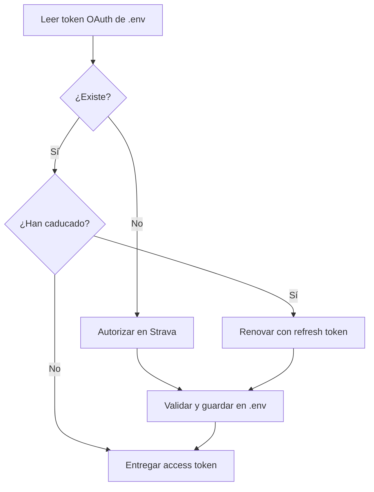

# Credenciales y almacenamiento de tokens

La aplicación no depende de Supabase ni de ninguna base de datos externa para
gestionar OAuth. Conserva un único juego de tokens en el `.env` local del
proyecto y renueva el access token cuando caduca.

## Configuración

Las credenciales de la aplicación de Strava se leen del entorno:

```dotenv
STRAVA_CLIENT_ID=<client-id>
STRAVA_SECRET_KEY=<client-secret>
```

Puede usarse un archivo `.env` local, que está excluido por `.gitignore`. Nunca
se deben incluir valores reales en ejemplos, commits, imágenes Docker o logs.

Después de completar OAuth, la aplicación añade y actualiza automáticamente
una única variable:

```dotenv
STRAVA_OAUTH_TOKEN=<token-json-generado-por-la-aplicacion>
```

No debe copiarse ni editarse manualmente. El valor contiene el access token, el
refresh token y su fecha de expiración. Se guarda sin cifrado porque almacenar
el texto cifrado y su clave Fernet en el mismo `.env` no ofrecería protección
adicional y añadiría un punto de fallo. Para este modo local, la protección
depende de que `.env` permanezca fuera de Git y tenga permisos `0600`.

## Archivos locales

De forma predeterminada se utilizan estas rutas:

| Contenido | Ruta |
| --- | --- |
| Credenciales y token OAuth | `.env` en la raíz del proyecto |
| Logs | `$XDG_STATE_HOME/strava-analysis/application.log` o `~/.local/state/strava-analysis/application.log` |

La aplicación conserva las demás variables y comentarios al actualizar el
token. `python-dotenv` realiza la sustitución mediante un archivo temporal y la
aplicación fija después los permisos de `.env` a `0600`.

`.env` está ignorado por Git. Las reglas históricas para `tokens.enc`,
`fernet.key` y `.strava-analysis/` se mantienen como defensa ante restos de
versiones anteriores.

## Ciclo OAuth



La respuesta OAuth se valida como `TokenSet` antes de persistirse. La ausencia
de `STRAVA_OAUTH_TOKEN` inicia la autorización; un JSON inválido produce un
error explícito y no se interpreta como si no hubiera credenciales.

## Aplicación inactiva en Strava

Si todas las consultas devuelven `403 Forbidden` y Strava informa de
`Application / Status / Inactive`, el token, los periodos y las opciones del
menú no son la causa: Strava ha desactivado la aplicación asociada al
`STRAVA_CLIENT_ID`.

Hay que comprobar su estado en <https://www.strava.com/settings/api>, confirmar
que el identificador y el secreto del `.env` pertenecen a esa aplicación y
completar cualquier paso de reactivación que solicite Strava. La
[guía oficial](https://developers.strava.com/docs/getting-started/) indica que
una suscripción de Strava es un requisito previo para registrar una aplicación
API. Si el panel no permite reactivarla aun teniendo la suscripción activa,
debe consultarse con el soporte para desarrolladores de Strava. Una vez activa,
puede ser necesario eliminar la línea `STRAVA_OAUTH_TOKEN` de `.env` y autorizar
de nuevo. Eliminar el token antes de reactivar la aplicación no resuelve este
error.

## Alcance de la protección

`.gitignore` evita que Git incluya `.env` por defecto, pero no sustituye los
permisos del sistema ni protege frente a procesos que puedan leer los archivos
de la cuenta. El token permite acceder a datos privados de Strava y debe
tratarse con el mismo cuidado que `STRAVA_SECRET_KEY`.

## Contenedores

`--env-file .env` carga las variables al iniciar un contenedor, pero los cambios
que la aplicación realice dentro de él no se copian automáticamente al archivo
del host. Para este flujo interactivo se recomienda ejecutar la CLI localmente.
Un despliegue en contenedor debería utilizar un gestor de secretos o montar un
almacenamiento escribible diseñado para persistir las renovaciones del token.

## Pruebas de seguridad local

Los tests crean archivos `.env` dentro de directorios temporales. Cubren
permisos, actualización sin perder otras variables, datos manipulados, limpieza
y errores del sistema de archivos sin leer credenciales reales del
desarrollador.
